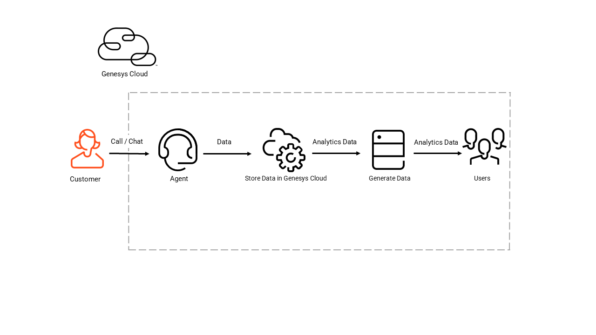
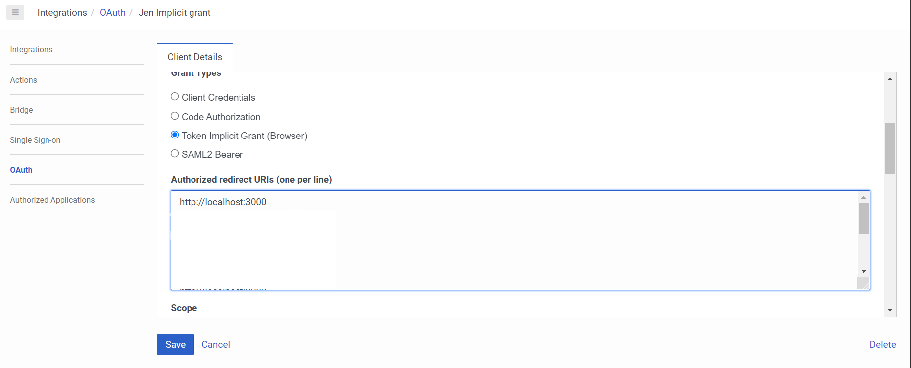
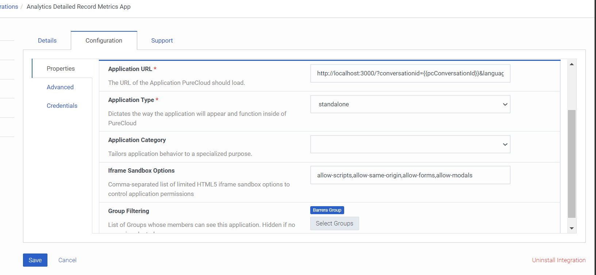
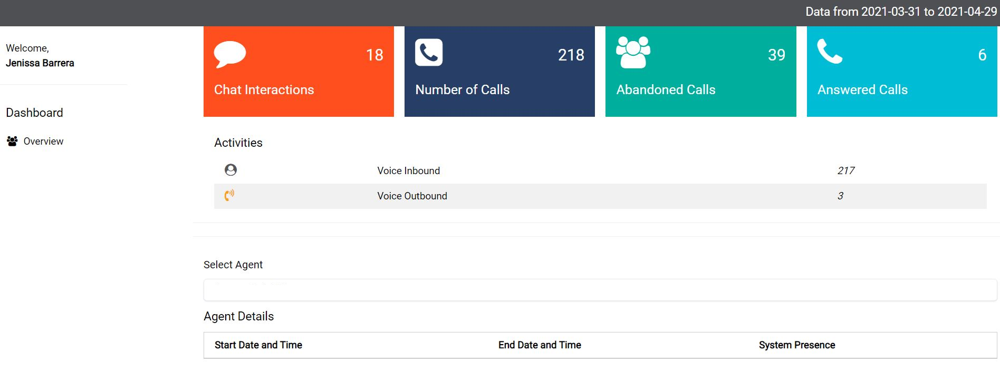
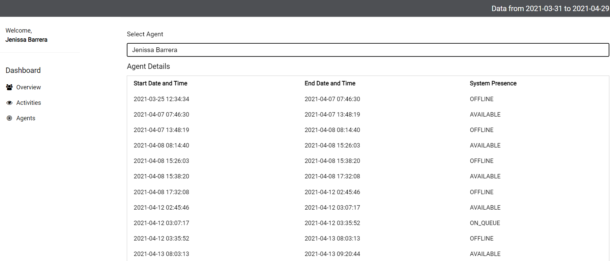

This Genesys Cloud Developer Blueprint explains how to get actual data that user can use to see the efficiency of their contact centers that focuses on users and conversation data. Using this app, users can see the historical details of their contact centers on a dashboard such as Number of calls, Agent Details, Number of Interactions,etc. This app can serve as a sample dashboard for users that later on, they can modify to serve their organization's needs.  

## Definitions

* **Analytics Query Builder** - The Analytics Query Builder developer tool provides a user interface that simplifies the creation of analytics queries. You pick the analytics criteria. The tool generates an analytics query that it runs against the Genesys Cloud Analytics API and returns a query result from your Genesys Cloud organization. You can use the JSON in the generated query in your own application.
* **Detailed Record Metrics** - Audit style records that capture a very fine-grained level of detail around user (e.g. agent) and customer interactions.
 
## Requirements

Implementing this solution requires experience in several areas or a willingness to learn:

- Administrator-level knowledge of Genesys Cloud and the Genesys AppFoundry
- Genesys Cloud Platform API knowledge

## Implementation steps

### Software development kits (SDKs)

* **Genesys Cloud Platform API SDK** - Client libraries used to simply integrate to Genesys Cloud. This SDK is used for getting the necessary historical data of agents and interactions.

* **Javascript SDK** - A JavaScript library to interface with the Genesys Cloud Platform API, see [Javascript SDK](https://www.npmjs.com/package/purecloud-platform-client-v2 "a").

### Genesys Cloud account requirements

This solution requires a Genesys Cloud license. For more information on licensing, see [Genesys Cloud Pricing](https://www.genesys.com/pricing "Opens the pricing article").

A recommended Genesys Cloud role for the solutions engineer is Master Admin. For more information on Genesys Cloud roles and permissions, see the [Roles and permissions overview](https://help.mypurecloud.com/?p=24360 "Opens the Roles and permissions overview article").

### Clone the repository containing the project files

* Download the [generate-detail-record-metrics-blueprint](https://github.com/GenesysCloudBlueprints/analytics-detail-record-metrics-blueprint "Opens the generate-detail-record-metrics-blueprint repository in GitHub") repository from GitHub.

### Generate an OAuth Client Token Implicit Grant in Genesys Cloud
1. Click this link and follow the step by step procedure on how to [Create an OAuth Client Token Implicit Grant](https://help.mypurecloud.com/articles/create-an-oauth-client/ "a"). 
2. Once the OAuth is successfully created. Go to Client Details. Make sure to add `http://localhost:3000` in the Authorize redirect URIs section. 
 
3. In the downloaded code sample, open the [config.js file](https://github.com/jenissabarrera/generate-detail-record-metrics-blueprint/blob/main/docs/scripts/config.js "a"). Add the clientID you generated. 
4. Specify the region of your Genesys Cloud organization e.g `mypurecloud.com, mypurecloud.au`.

### Host and run the Nodejs.app server

1. Make sure that you are using the updated Node.js version. 

  * Open the command line in the directory where you want to save the project and install the latest version. Type `npm install -g n latest`.

2. Go to the directory where the files are located and install node modules. Type `npm install`  
3. Run the server locally, type `node index.js` in the command line. Go to your browser and open http://localhost:3000/ to check if the app is successfully working on your localhost.

### Install and activate the Analytics Detailed Record Metrics App in your Genesys Cloud Platform

1. Go to your Genesys Cloud Org and add the integration. Search for Client Application and click the install button.
 
2. Go to the details tab and rename the integration to your desired name, and make sure to toggle Active.
 
3. Click the configuration tab. Make sure to change to change the Application URL value to `http://localhost:3000/?conversationid={{pcConversationId}}&language={{pcLangTag}}`. On the group filtering, make sure to include the groups where the users of this app are included. 
   
4. Once done with all the changes, don't forget to click Save.

### Test the solution

1. Open the Application on the Apps menu. On the dashboard the user will see basic conversation details such as number of chats, calls, abandoned calls and other details from a certain date range. 
  
2. Click on Select Agent and details of the selected agent will generate on the table. 
   

    * In modifying the code, the user can use the [Analytics query builder](https://developer.genesys.cloud/developer-tools/#/analytics-query-builder "a") in generating the body for each query execution. It also generates the date format that will be needed for the code. 

## Additional resources
* [Genesys Cloud Developer Center](https://developer.mypurecloud.com/ "a")
* [Analytics Query Builder developer tool quick start](https://developer.mypurecloud.com/gettingstarted/developer-tools-analytics-query.html "a")
* [Analytics Overview](https://developer.mypurecloud.com/api/rest/v2/analytics/overview.html#:~:text=Genesys%20Cloud%20provides%20a%20rich,performance%20and%20customer%2Fagent%20interactions. "a")

### Download the repository containing the project files

## Scenario

## Solution

## Content

## Prerequisites

### Specialized knowledge
